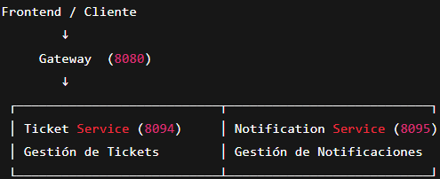

Ejecutar en este orden:

1. Gateway  
2. Ticket Service  
3. Notification Service  

🚀 Microservicio: Tickets – Notificaciones – Gateway

Este proyecto está compuesto por tres microservicios independientes, diseñados para gestionar solicitudes de soporte dentro de un instituto.
Incluye un API Gateway, que centraliza el acceso y administra las rutas entre servicios.

🧩 Microservicios incluidos
1️⃣ Ticket Service

Gestiona la creación y seguimiento de tickets enviados por estudiantes.

Funciones principales:

Crear ticket

Listar por estudiante

Filtrar por estado

Actualizar estado del ticket

Puerto: 8094

2️⃣ Notification Service

Crea notificaciones internas relacionadas a estudiantes o personal.

Funciones principales:

Crear notificación

Listar notificaciones

Actualizar estado (pending / sent / failed)

Puerto: 8095

3️⃣ API Gateway

Punto único de entrada para todos los microservicios.
Gestiona rutas, CORS y futuras integraciones con seguridad (JWT / OAuth2 / AWS Cognito).

Puerto: 8080

Endpoints Principales

Ticket Service
POST   /api/tickets
GET    /api/tickets
GET    /api/tickets/{id}
PATCH  /api/tickets/{id}/estado

Notification Service
POST   /api/notifications
GET    /api/notifications
PATCH  /api/notifications/{id}/status

▶️ Cómo ejecutar el proyecto

Clonar el repositorio:

git clone <url-del-repositorio>

Abrir cada microservicio (gateway, tickets, notifications).

🛠 Requisitos

Java 21

Maven

MySQL o PostgreSQL según configuración

IDE recomendado: IntelliJ IDEA / VSCode / Eclipse

🔒 Seguridad (en desarrollo)

El Gateway ya está preparado para:

OAuth2

JWT

AWS Cognito

Configuración centralizada de CORS

Actualmente todo está en modo abierto para facilitar el desarrollo.

Estado del Proyecto

Versión inicial funcional vía HTTP.
Se agregarán mejoras de seguridad y comunicación entre servicios.

✨ Autor

polox
